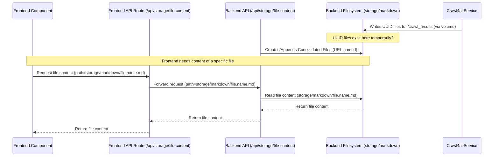

# Refactoring Plan: Remove In-Memory File Handling

**Date:** 2025-04-02

**Author:** Roo (Architect Mode)

**Status:** Approved

## 1. Goal

Simplify the application architecture by eliminating the complex in-memory storage mechanism for UUID-named files generated during the crawl process. The application will rely solely on the consolidated files stored on disk in the `storage/markdown` directory.

## 2. Rationale

The current in-memory file handling feature introduces significant complexity:

*   Monkey-patching the built-in `open` function (`redirecting_open` in `crawler.py`).
*   Logic to differentiate between "individual" (UUID) and "consolidated" (URL-named) files.
*   State management (`in_memory_files` dictionary) within the backend process, which is ephemeral and potentially memory-intensive.
*   Dedicated API endpoints on both backend (`/api/memory-files/...`) and frontend proxy (`/api/memory-file`) layers.

Furthermore, investigation revealed inconsistencies:

*   UUID-named files appear on disk (likely in `./crawl_results` via volume mount from the `crawl4ai` container), suggesting the backend's in-memory capture logic might be bypassed or ineffective for these files' initial creation.
*   The presence of UUID files in `./storage/markdown` (as seen in user-provided screenshot) is unexplained by the current codebase and suggests potential bugs or misconfigurations in file handling.

While frontend components (`StoredFiles.tsx`, `DiscoveredFiles.tsx`) *do* attempt to use the API to read from memory, the reliability and necessity of this mechanism are questionable given the disk persistence.

Removing this feature aligns with KISS and YAGNI principles, simplifying the data flow, reducing potential bugs, and making the system easier to understand and maintain.

## 3. Affected Components

*   `backend/app/crawler.py`
*   `backend/app/main.py`
*   `app/api/memory-file/route.ts`
*   `components/StoredFiles.tsx`
*   `components/DiscoveredFiles.tsx`

## 4. Proposed Steps

### Step 4.1: Backend Refactoring (`crawler.py`)

*   **Remove:** `in_memory_files` global dictionary.
*   **Remove:** `MemoryFileObject` class definition.
*   **Remove:** `is_individual_file` helper function.
*   **Remove:** `redirecting_open` function and the `builtins.open = redirecting_open` line.
*   **Remove/Simplify:** `redirect_file_writes` function (likely remove entirely).
*   **Remove:** `_task_context` dictionary and `set_task_context` function.
*   **Review:** `discover_pages` and `test_crawl4ai` functions to ensure they correctly write/append consolidated results to URL-named files in `storage/markdown` without relying on the removed redirection logic. Remove logging/logic related to skipping individual files.

### Step 4.2: Backend API Refactoring (`main.py`)

*   **Remove:** `/api/memory-files` endpoint (function `list_memory_files`).
*   **Remove:** `/api/memory-files/{file_id}` endpoint (function `get_memory_file`).
*   **Remove:** Associated imports (`in_memory_files`, `is_individual_file`).
*   **Add:** New endpoint (e.g., `/api/storage/file-content`) that accepts a file path (relative to `storage/markdown`) and returns the content of that file from disk.

### Step 4.3: Frontend API Route Refactoring

*   **Delete:** `app/api/memory-file/route.ts`.
*   **Add:** New API route (e.g., `app/api/storage/file-content/route.ts`) to proxy requests for the new backend endpoint (`/api/storage/file-content`).

### Step 4.4: Frontend Component Refactoring (`StoredFiles.tsx`, `DiscoveredFiles.tsx`)

*   **Identify:** Code calling `fetch('/api/memory-file?id=...')`.
*   **Modify:** Change fetch calls to use the new frontend API route (e.g., `fetch('/api/storage/file-content?path=...')`).
*   **Update:** Ensure the correct file path (relative to `storage/markdown`, likely the consolidated URL-based filename) is passed. This might require changes in how file data is managed and passed to these components.

## 5. Simplified Flow Diagram

## 6. Next Steps

*   Switch to Code mode to implement the refactoring steps outlined above.
*   Test thoroughly to ensure frontend components display file content correctly using the new disk-based approach.