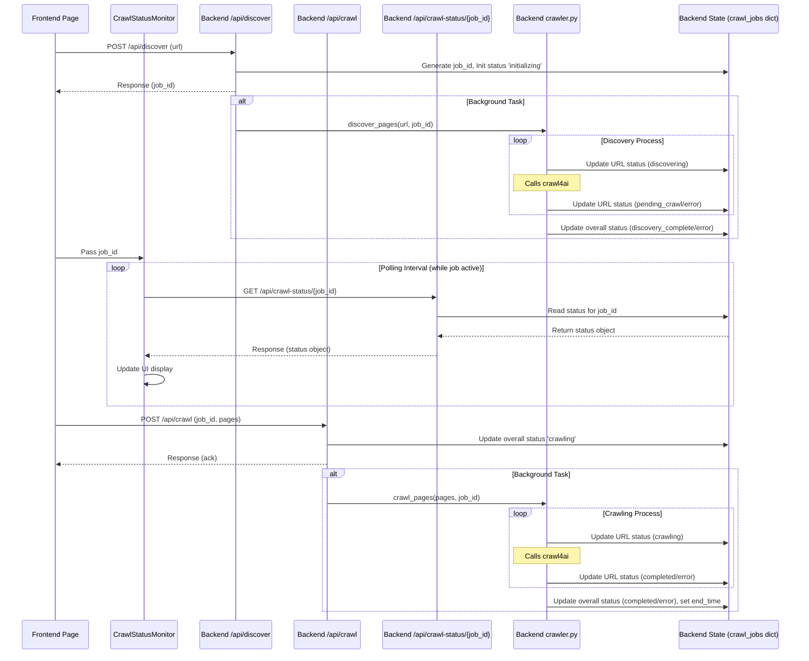

# Feature Plan: Real-time Crawl Status Monitoring (Polling)

**Date:** 2025-04-03

**Author:** Roo (Architect Mode)

**Status:** Approved

## 1. Goal

Provide users with near real-time visibility into the URL discovery and content crawling processes by displaying the status of individual URLs being processed.

## 2. Approach: Backend State + Frontend Polling

A simple in-memory dictionary on the backend will track the status of active jobs and the state of each URL within those jobs. A new API endpoint will expose this status. The frontend will periodically poll this endpoint and update a dedicated UI component to display the progress.

**Rationale:** This approach offers a good balance between implementation simplicity (avoiding WebSockets/SSE for MVP) and providing valuable feedback to the user, enhancing the UX significantly compared to the current opaque process. It adheres to KISS principles for the initial implementation.

## 3. Affected Components

*   `backend/app/main.py`
*   `backend/app/crawler.py`
*   `app/page.tsx` (or relevant initiating component)
*   New Component: `components/CrawlStatusMonitor.tsx`

## 4. Proposed Implementation Steps

### Step 4.1: Backend - Status Tracking & API (`main.py`)

1.  **State Storage:** Define a global dictionary `crawl_jobs = {}` at the module level.
2.  **Status Model:** Define a Pydantic model `CrawlJobStatus` (e.g., `job_id: str`, `overall_status: str`, `urls: Dict[str, str]`, `start_time: Optional[datetime]`, `end_time: Optional[datetime]`, `error: Optional[str]`). Possible `overall_status` values: `initializing`, `discovering`, `discovery_complete`, `crawling`, `completed`, `error`. Possible URL statuses: `pending_discovery`, `discovering`, `discovery_error`, `pending_crawl`, `crawling`, `crawl_error`, `completed`.
3.  **Modify `/api/discover`:**
    *   Generate `job_id = str(uuid.uuid4())`.
    *   Get `root_url` from the request.
    *   Initialize `crawl_jobs[job_id] = CrawlJobStatus(job_id=job_id, overall_status='initializing', urls={root_url: 'pending_discovery'}, start_time=datetime.now())`.
    *   Modify the call to `discover_pages` to run as a background task (e.g., using FastAPI's `BackgroundTasks` or `asyncio.create_task`). Pass `job_id` and `root_url` to `discover_pages`.
    *   Return immediate response: `{"message": "Discovery initiated", "job_id": job_id}`.
4.  **Modify `/api/crawl`:**
    *   Add `job_id: str` to the request model (`CrawlRequest`).
    *   Retrieve the job status: `job_status = crawl_jobs.get(job_id)`. Handle `job_not_found` error.
    *   Update `job_status.overall_status = 'crawling'`.
    *   Initialize URL statuses for pages to be crawled: `for page in request.pages: job_status.urls[page.url] = 'pending_crawl'`.
    *   Modify the call to `crawl_pages` to run as a background task. Pass `job_id` and `root_url` (if needed, or retrieve from `job_status`).
    *   Return immediate response: `{"message": "Crawling started", "job_id": job_id}`.
5.  **Add `GET /api/crawl-status/{job_id}`:**
    *   Define endpoint accepting `job_id` path parameter.
    *   Retrieve `job_status = crawl_jobs.get(job_id)`.
    *   If found, return `job_status`.
    *   If not found, return 404 error.

### Step 4.2: Backend - Update Status (`crawler.py`)

1.  **Import:** `from .main import crawl_jobs` (handle potential circular imports if necessary, e.g., by passing `crawl_jobs` dict as an argument or using a separate status module).
2.  **Modify `discover_pages`:**
    *   Add `job_id: str` parameter.
    *   Before calling `crawl4ai` for `url`: `if job_id in crawl_jobs: crawl_jobs[job_id]['urls'][url] = 'discovering'`.
    *   After `crawl4ai` call (in `try/except/finally`): Update `crawl_jobs[job_id]['urls'][url]` to `'pending_crawl'` (if successful discovery with links), `'discovery_error'`, or `'discovery_timeout'`.
    *   At the start/end of the function: Update `crawl_jobs[job_id]['overall_status']` (e.g., to `'discovering'`, `'discovery_complete'`).
3.  **Modify `crawl_pages`:**
    *   Add `job_id: str` parameter.
    *   Before calling `crawl4ai` for `page.url`: `if job_id in crawl_jobs: crawl_jobs[job_id]['urls'][page.url] = 'crawling'`.
    *   After `crawl4ai` call (in `try/except/finally`): Update `crawl_jobs[job_id]['urls'][page.url]` to `'completed'`, `'crawl_error'`, or `'crawl_timeout'`.
    *   At the end of the function (success or failure): Update `crawl_jobs[job_id]['overall_status']` to `'completed'` or `'error'`, set `end_time`, and potentially add error message.

### Step 4.3: Frontend - Initiate and Store Job ID (`app/page.tsx` or similar)

1.  **State:** Add state variable `const [currentJobId, setCurrentJobId] = useState<string | null>(null);`.
2.  **Discover Call:** When calling `/api/discover`, store the returned `job_id` using `setCurrentJobId`. Reset `currentJobId` when starting a new discovery.
3.  **Pass Prop:** Pass `currentJobId` to the `CrawlStatusMonitor` component.
4.  **Crawl Call:** When calling `/api/crawl`, include the `currentJobId` in the request body.

### Step 4.4: Frontend - Display Status (`components/CrawlStatusMonitor.tsx`)

1.  **Create Component:** `CrawlStatusMonitor({ jobId }: { jobId: string | null })`.
2.  **State:** `const [status, setStatus] = useState<CrawlJobStatus | null>(null);`, `const [error, setError] = useState<string | null>(null);`.
3.  **Polling Effect:**
    *   Use `useEffect` hook triggered by `jobId`.
    *   If `jobId` is null, clear status/error and return.
    *   Set up `interval = setInterval(fetchStatus, 3000);` (e.g., 3 seconds).
    *   Define `fetchStatus = async () => { ... }` which calls `GET /api/crawl-status/{jobId}`, updates `status` state on success, or `error` state on failure. Handle cases where the job might be complete to stop polling.
    *   Return cleanup function `() => clearInterval(interval);`.
4.  **Render Logic:**
    *   If no `jobId`, render nothing or placeholder.
    *   If loading/polling, show indicator.
    *   If error, display error message.
    *   If status available:
        *   Display `status.overall_status`.
        *   Display `start_time`, `end_time`.
        *   Render a list/table iterating through `Object.entries(status.urls)` showing `[url, urlStatus]`. Use different styling/icons based on `urlStatus`.

## 5. Sequence Diagram

## 6. Next Steps

*   Switch to Code mode to implement the changes outlined above.
*   Test thoroughly.