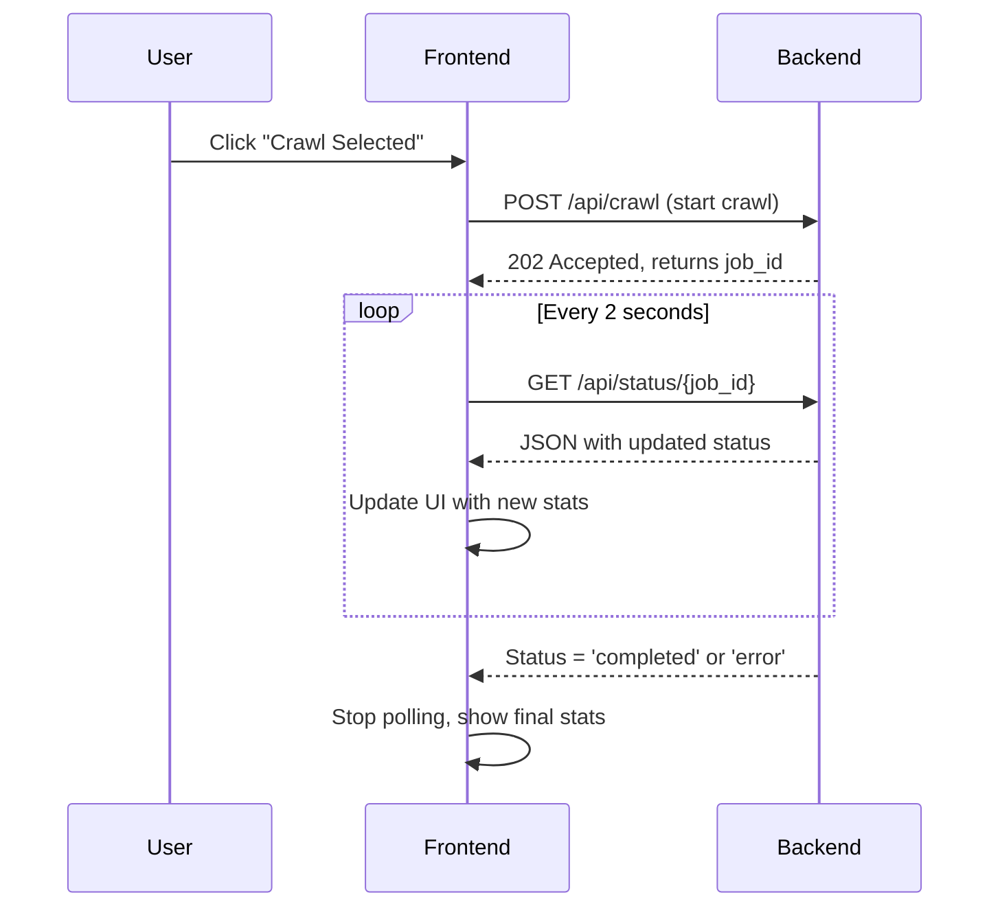

# Frontend Crawl Status Polling & Live Update Plan

---

## **Root Cause**

- The backend **crawls all URLs and updates status correctly**.
- The frontend **does NOT poll** the backend for updated crawl status.
- The UI **never refreshes** crawl progress, pages crawled, or data extracted.
- User sees **stale info** until manual refresh.

---

## **Goal**

Implement **automatic polling** in the frontend to:

- Fetch **latest crawl job status** every few seconds.
- Update:
  - Number of pages crawled
  - Data extracted
  - URL statuses (hourglass, checkmark, error)
  - Overall job status
- Stop polling when crawl is **completed** or **error**.

---

## **Design Overview**



---

## **Implementation Steps**

### 1. **Start crawl**

- User clicks "Crawl Selected"
- Frontend sends POST `/api/crawl`
- Backend responds with `job_id`
- **Start polling** with this `job_id`

### 2. **Polling logic**

- Use `setInterval()` or `useEffect` + `setInterval`
- Every **2 seconds**:
  - Call `/api/status/{job_id}`
  - Parse response:
    - `pages_crawled`
    - `data_extracted`
    - URL statuses
    - Overall status
  - **Update UI state**

### 3. **Update UI**

- Update:
  - **Statistics** (pages crawled, data extracted)
  - **URL list** (status icons)
  - **Overall job status**

### 4. **Stop polling**

- When backend returns:
  - `overall_status` = `'completed'`, `'completed_with_errors'`, or `'error'`
- Or after a **timeout** (e.g., 5 minutes)
- Show final stats

### 5. **Error handling**

- If API call fails:
  - Show error message
  - Retry on next poll

---

## **Minimal Code Outline**

```typescript
useEffect(() => {
  if (!jobId) return;

  const pollInterval = setInterval(async () => {
    const res = await fetch(`/api/status/${jobId}`);
    const data = await res.json();

    // Update UI state with data
    setJobStatus(data);

    if (['completed', 'completed_with_errors', 'error'].includes(data.overall_status)) {
      clearInterval(pollInterval);
    }
  }, 2000);

  return () => clearInterval(pollInterval);
}, [jobId]);
```

---

## **Where to implement**

- Likely in `components/CrawlStatusMonitor.tsx`
- Or a **parent component** managing crawl state
- Use **React state** to update UI

---

## **Options**

### Option 1: **Simple polling (Recommended)**

- Use `setInterval` in `useEffect`
- Poll every 2 seconds
- Stop on completion/error
- **Confidence: 10/10**

### Option 2: **SWR or React Query**

- Use data fetching libraries with built-in polling
- More complex, but better caching
- **Confidence: 8/10**

---

## **Summary**

- The **backend is working fine**.
- The **frontend must poll** crawl status to reflect live progress.
- Implement **simple polling** for minimal, robust fix.

---

## **Next**

- Confirm this plan.
- Then generate the **exact code diff** to implement polling.